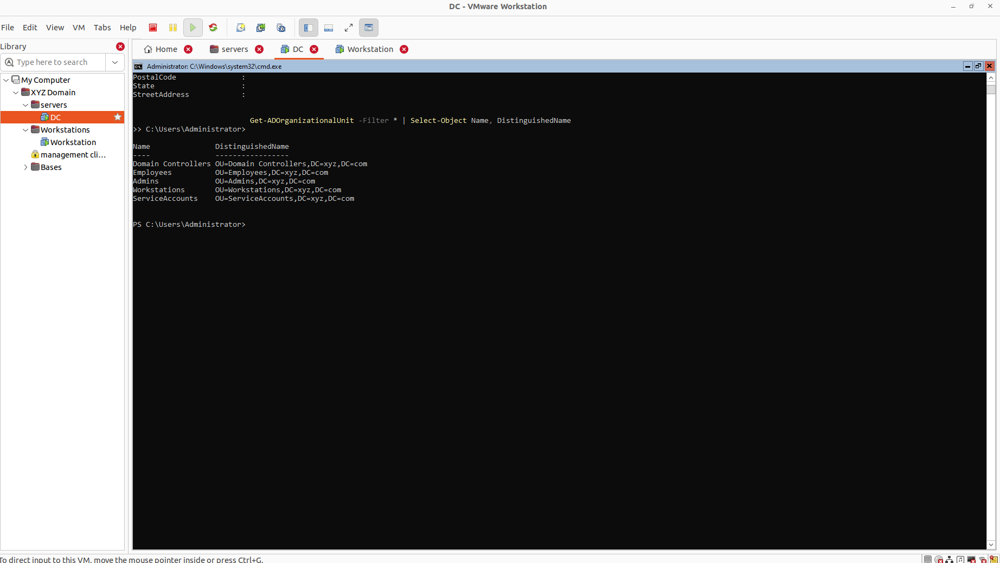
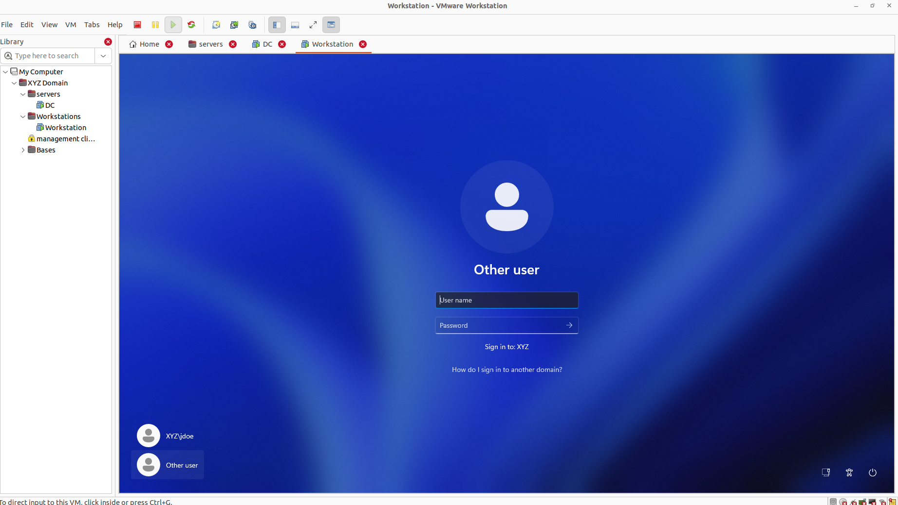
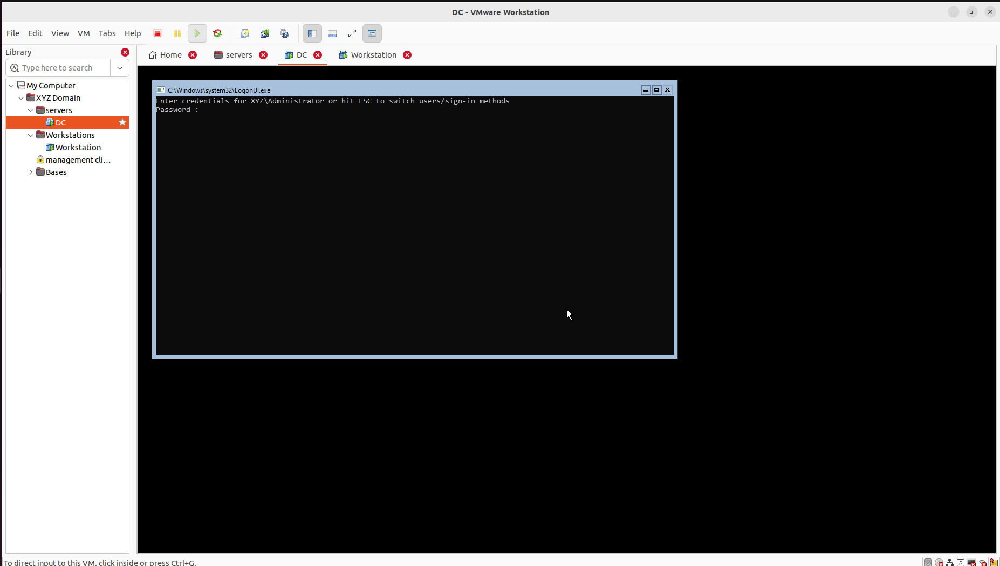
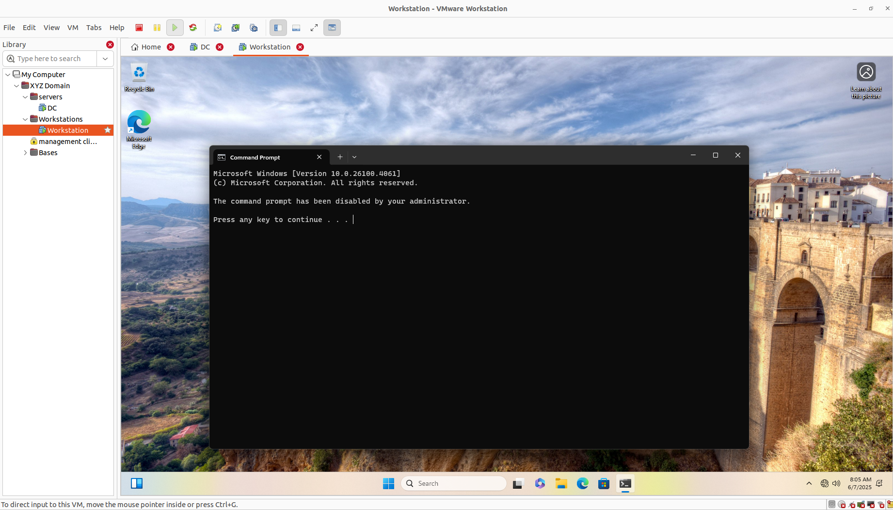

# 🖥️ Active Directory Lab (Server Core + PowerShell)

This lab simulates a small enterprise Active Directory environment using **Windows Server Core 2022** and **Windows 11 Pro**. All admin tasks were done via **PowerShell**, no GUI tools.

---

## 🔧 Setup Overview

| Component         | Detail                    |
|------------------|---------------------------|
| Domain           | xyz.com                   |
| Domain Controller| Windows Server Core 2022  |
| Client Machine   | Windows 11 Pro            |
| Management Style | 100% PowerShell           |

---

## 🏗️ AD Set up 

### ✅ Organizational Units
Created core OUs via PowerShell:
     ```powershell
 New-ADOrganizationalUnit -Name "Employees" -Path "DC=xyz,DC=com"
 New-ADOrganizationalUnit -Name "Admins" -Path "DC=xyz,DC=com"
 New-ADOrganizationalUnit -Name "Workstations" -Path "DC=xyz,DC=com"
 New-ADOrganizationalUnit -Name "ServiceAccounts" -Path "DC=xyz,DC=com"


# 👤 Domain Logins

User `jdoe` was created under the **Employees** OU and successfully logged into the domain-joined Windows 11 machine.





---

# 🚫 CMD Restriction via GPO

Used Group Policy to disable Command Prompt for standard users:


```powershell
 Set-GPRegistryValue -Name "Employee Desktop Policy" `
  -Key "HKCU\Software\Policies\Microsoft\Windows\System" `
  -ValueName "DisableCMD" -Type DWord -Value 1


 
